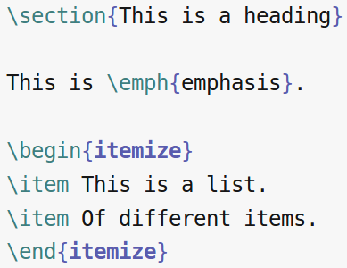
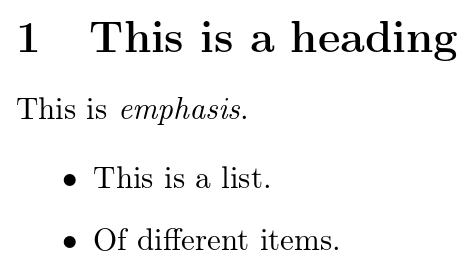
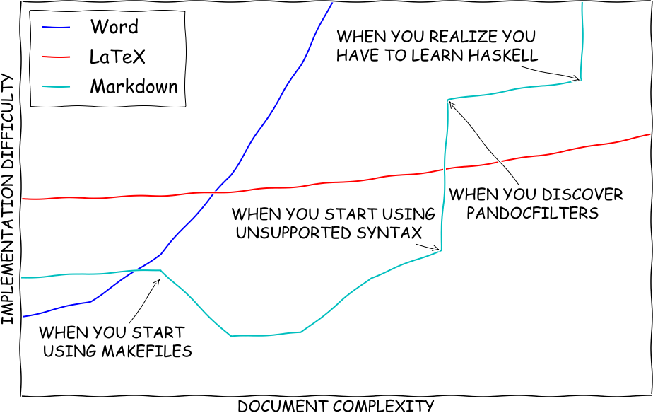
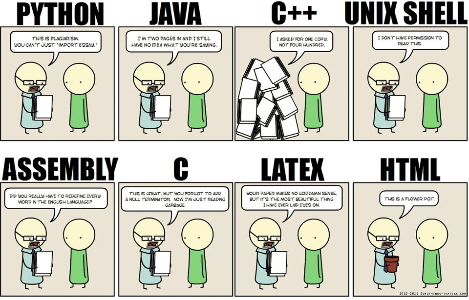
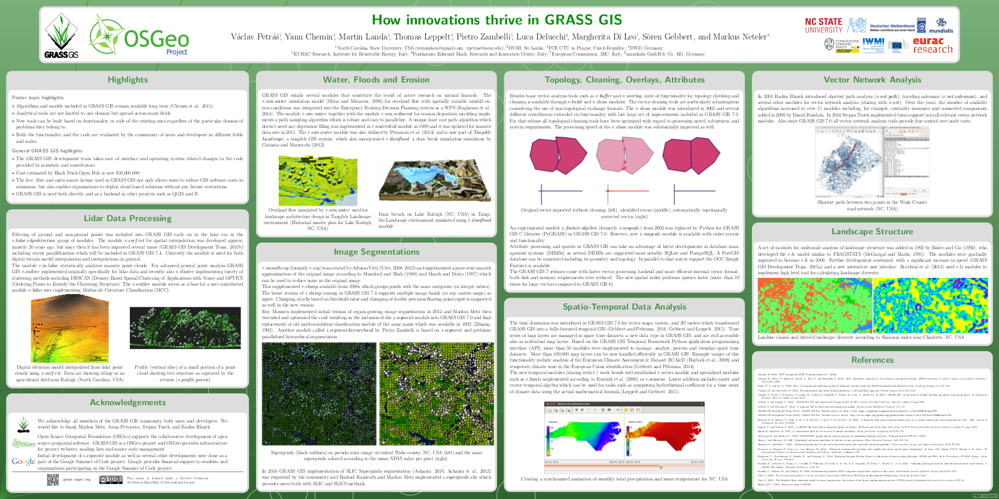
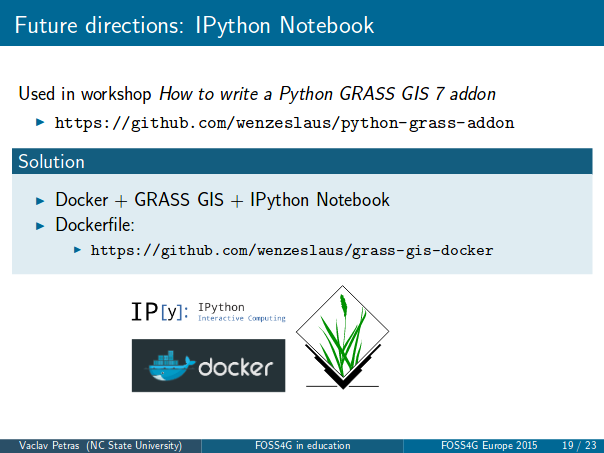
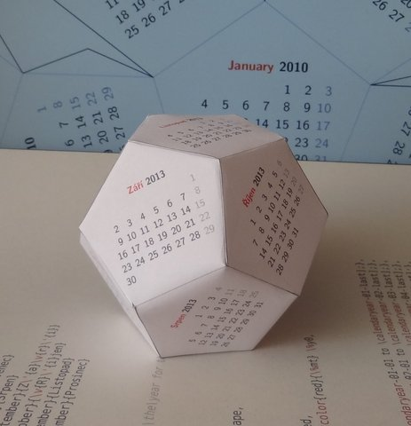

Advanced tools for papers and reports
=====================================

In this part we focus on LaTeX, how to use with Overleaf,
and we compare it with Markdown and reStructuredText
which can be used e.g. with Pandoc.

Tools
-----

Overleaf
````````

https://www.overleaf.com

Overleaf is a freemium cloud platform with core processing
backend - LaTeX - which is open source software.

Overleaf project can be downloaded as a ZIP file of text files and
images which can be processed on any computer with LaTeX installed.
Typical LaTeX installation consist of several backend (command line)
tools such as *tex* or *pdflatex* and a dedicated text editor,
for example *Texmaker* or *Kile*,
which understands the LaTeX syntax and can compile the files into
an output document, typically PDF.
Thanks to this, Overleaf is a cloud platform which provides users
with a way out, thus preserving their freedom (in the area of software,
tools, and service providers).

Overleaf also has a rich text mode which is good for people who don't
know LaTeX.

LaTeX
`````

Here is an example LaTeX code::

    \section{This is a heading}

    This is \emph{emphasis}.

    \begin{itemize}
    \item This is a list.
    \item Of different items.
    \end{itemize}



    LaTeX when edited in a text editor or in Overleaf



    Part of the PDF generated from the LaTeX code

**What is LaTeX?** LaTeX is a typesetting system or simply a program
for creating text documents such as scientific papers or posters.
Generally speaking LaTeX is a desktop publishing (DTP) program.

**How to pronounce LaTeX?**
The *La* at the beginning is coming from
original author Leslie Lamport who extended *TeX*.
The *X* at the end is an uppercase Greek letter chi.
In English, LaTeX is usually pronounced lah-tekh, lah-tek, or lay-tek.

**What is LaTeX good for?**
The usage is very broad. It is most commonly used for technical and
scientific texts such as scientific papers, dissertations, books
and textbooks.
It is also used for presentation slides or scientific posters.
The code can be easily generated e.g. in Python, so it is used
for automated generation of PDFs.

**What LaTeX does?**
Besides common formatting of text such as cursive and bold,
LaTeX can automatically create table of contents, numbered headings,
cross references, footnotes, and literature citations.
Advantages of LaTeX are best visible when creating numbered list and
bullet points as everything is very organized and controlled.
When using LaTeX you don't have to think much about typographic rules
or know them because LaTeX will take of it.

**What is LaTeX best know for?**
LaTeX is often highlighted as a tool to typeset math equations
and the LaTeX syntax or LaTeX itself is used in other tools
to create math equations.
LaTeX is also generally better than other tools in typographically
perfect justification of text into block where LaTeX automatically and
reliably hyphenates words in different languages.

**What are the limitations of LaTeX?**
The workflow usually requires
The functionality of LaTeX is practically unlimited since it is
a full programming language.
If LaTeX can't do something, user can always program it to do it.
Generally, this is of course not practiced because there is a large
amount of packages which usually already cover the functionality
you wish for.

**Do I have to remember all the commands?**
That's not necessary, because the common commands can be included using
a button in a editor.
For complicated and less common commands, people usually use existing
examples online.

**What is the bare minimum I need to learn?**
The important part are the concepts, not the exact commands.
First part is to become comfortable with textual representation of the
formatting, for example that the bold text is not in bold in source text
but it is marked with the specific command.
Another part is that everything is a command. Creating a table of
contents is as simple as writing bold text, it is one command.

**What is the difference between LaTeX and a text editor?**
First, LaTeX is not a text editor. It is a program which creates PDF or
other documents from plain text files which contain LaTeX commands.
It is focused on text, not graphics, but it is actually quite powerful
in creating graphics as well.
LaTeX is commonly used with a text editor which understands LaTeX
and supports user in writing LaTeX documents.
Things related to the text file such as spell checking are handled
by the text editor (rather than LaTeX).

**How is LaTeX used without Overleaf?**
As users, we write text in a text editor which supports LaTeX.
Whenever we run LaTeX (e.g. using a button or shortcut the in editor),
LaTeX creates a PDF document (typically) which can be viewed in a PDF
viewer (or embedded viewer in the editor).

**How LaTeX works?** As users, we add tags (or commands) to the text which
tell LaTeX how to process and typeset the text. It is similar to how
HTML and web browser work when formatting web pages.



    A very "scientific" comparison of Word, LaTeX, and Markdown.
    This figure is from `Writing Technical Papers with Markdown`_ © 2015 Dheepak Krishnamurthy.

.. _Writing Technical Papers with Markdown: http://blog.kdheepak.com/writing-papers-with-markdown.html



    If programming languages were essays.
    Note the LaTeX part: *Your paper makes no sense, but it's the
    most beautiful thing I ever laid my eyes on.*
    (Original author unknown.)

.. _Writing Technical Papers with Markdown: http://blog.kdheepak.com/writing-papers-with-markdown.html

Here is an example of one of the advanced things you can do in LaTeX
and that's definition of your own command. We will define command
``\gmod`` which we will use in text to refer to GRASS GIS modules
(for the purpose of this example)::

    \newcommand{\gmod}[1]{\emph{#1}}

The parameter is refereed to using ``#1``. Otherwise the syntax is::

    \newcommand{\nameOfTheNewCommand}[number of parameters]{definition}

Here is how we use it::

    Let's talk about some GRASS GIS modules, for example we can talk
    about \gmod{g.region} or perhaps \gmod{r.shade}. The \gmod{v.buffer}
    module is good too.

So far we were defining just the style (emphasis in particular),
let's add a link to GRASS GIS documentation where name of the module
is part of the URL which looks for example like::

    https://grass.osgeo.org/grass72/manuals/g.region.html

The modified version of the command now uses ``\href`` command which
has two parameters, the URL and the text to show::

    \newcommand{\gmod}[1]{\href{https://grass.osgeo.org/grass72/manuals/#1.html}{\emph{#1}}}

During compilation, newlines are converted to spaces and whitespace at
the beginning of the line is ignored, so we can also write the same
on multiple lines. However, in that case, it is often necessary to
(and a best practice) to include percent signs at the end of the line
as follows::

    \newcommand{\gmod}[1]{%
        \href%
            {https://grass.osgeo.org/grass72/manuals/#1.html}%
            {\emph{#1}}%
    }



    An example of a poster created in LaTeX using *tikzposter* package.



    An example of one slide from a set of presentation slides created
    in LaTeX using *beamer* package.



    Calendar as dodecahedron created in LaTeX using *tikz* package
    as an example what can be done.
    See it at TeXample.net_ or in Overleaf_.

.. _TeXample.net: http://www.texample.net/tikz/examples/foldable-dodecahedron-with-calendar/
.. _Overleaf: https://www.overleaf.com/docs?snip_uri=http://www.texample.net/media/tikz/examples/TEX/foldable-dodecahedron-with-calendar.tex&splash=none


ShareLaTeX
``````````

https://www.sharelatex.com

ShareLaTeX is a freemium cloud platform and an open source software
(i.e. you can either use the freemium cloud platform or setup ShareLaTeX
on any server).
ShareLaTeX is under GNU AGPL license.

You can use LaTeX in ShareLaTeX in the same way as you can use it in
Overleaf.

Markdown with Pandoc
````````````````````
http://pandoc.org

Markdown is a simple markup language for include formatting into a
plain text document. Pandoc is a conversion tool which can convert
Markdown files and many other files into other formats.

Pandoc is licensed under GNU GPL.

reStructuredText with Sphinx/Docutils
`````````````````````````````````````

reStructuredText: http://docutils.sourceforge.net/rst.html

Docutils: http://docutils.sourceforge.net

Sphinx: http://sphinx-doc.org

**reStructuredText** is an plain text markup syntax similar to
aforementioned Markdown. It is often used for software
documentation, for example in Python docstrings.
reStructuredText is, unlike Markdown, designed for extensibility for
specific application domains.
reStructuredText is applicable to non-trivial cases like LaTeX,
but still striving to keep simple syntax like Markdown.

**Docutils** is an open-source text processing system for processing
plain text into formats, such as HTML, LaTeX, man-pages, open-document
or XML.
Docutils processes reStructuredText and can be used from command line
or as a Python package. Another software which can process
reStructuredText in a similar manner is Pandoc.

**Sphinx** is a tool that creates documentation from reStructuredText sources.
It is used for Python documentation and it is universal enough to be
used for software projects in general.
The output formats include HTML, LaTeX (for printable PDF versions),
ePub, and more.
Sphinx uses the Docutils to parse the reStructuredText.

Sphinx is licensed under BSD and Docutils are placed into public domain.

Resources
---------

Texts
`````

* `A very basic guide to start writing in LaTeX right now <https://medium.com/the-start-codon/a-very-basic-guide-to-start-writing-in-latex-right-now-1c9062e2415a>`_
* `How to use Overleaf to Write your papers: Part I: Basic Minimalist setup <https://medium.com/thoughts-philosophy-writing/how-to-use-overleaf-to-write-your-papers-part-i-basic-minimalist-setup-6599268c095f>`_
* `How to use Overleaf to Write your papers: Part II: Tables, Figures, Bibliography <https://medium.com/thoughts-philosophy-writing/how-to-use-overleaf-to-write-your-papers-part-ii-tables-figures-bibliography-7a4e921227fd>`_
* `How to use Overleaf to Write your papers: Part III: How to use Markdown with Overleaf with help from Git and Pandoc <https://medium.com/thoughts-philosophy-writing/how-to-use-overleaf-to-write-your-papers-part-iii-how-to-use-markdown-with-overleaf-with-help-80f1e27a65a>`_
* `Writing Technical Papers with Markdown <http://blog.kdheepak.com/writing-papers-with-markdown.html>`_
* `reStructuredText Primer for Sphinx <http://www.sphinx-doc.org/en/stable/rest.html>`_
* `Differencees between reStructuredText, Docutils, and Sphinx <https://coderwall.com/p/vemncg/what-is-the-difference-rest-docutils-sphinx-readthedocs>`_
* `reStructuredText vs Markdown for documentation <http://zverovich.net/2016/06/16/rst-vs-markdown.html>`_
* `How to Organise writing and research using Overleaf, Evernote, and Zotero <https://medium.com/@arinbasu/how-to-organise-writing-and-research-using-overleaf-evernote-and-zotero-4c51870a91dc>`_ (example of full workflow involving several tools, some parts can be left out or replaced as needed)
* `WYSIWYG <https://en.wikipedia.org/wiki/WYSIWYG>`_
* `WYSIWYM <https://en.wikipedia.org/wiki/WYSIWYM>`_

Videos
``````

* `An Introduction to Overleaf <https://www.youtube.com/watch?v=g8Ejj0T0yG4>`_ (3 mins)
* `Beginners LaTeX Tutorial with ShareLaTeX <https://www.youtube.com/watch?v=Qg2WtaSy-zQ&list=PLCRFsOKSM7ePUBOfh3O-K5XZldM5uCPwk>`_ (playlist)

Related services
````````````````

* `Detexify <http://detexify.kirelabs.org/classify.html>`_ (converts handwritten symbols to LaTeX)
* `MyScript Webdemo: Math <http://webdemo.myscript.com/views/math.html>`_ (converts handwritten equations to LaTeX)
* `Try Pandoc! <https://pandoc.org/try/>`_ (format conversions using Pandoc)

Assignment
----------

Take some of your documents which contains headings, figures, tables,
equations, and bibliography and recreate it in LaTeX. If you don't have
a suitable document, you can use this paper_ or any other suitable
document which contains all or most of the aforementioned elements.
Scientific papers will usually work. If you are writing
a report for assignment from another class, you can use that as well.
In any case, you don't have to recreate the whole document,
include just enough to try each of the elements.

.. _document: https://opengeospatialdata.springeropen.com/articles/10.1186/s40965-017-0021-8

Alternatively, if you already familiar with LaTeX,
extend the following LaTeX document in Overleaf
by providing a comprehensive description of some basic feature such as
tables, equations or bibliography,
or introduction to some advanced feature or package.
Here is a read-only link for document
(read-write link will be shared on the message board):

https://www.overleaf.com/read/gwmnkbcdrzmz

Three more alternative or bonus tasks:
Create some other type of document in LaTeX other
than a paper, for example poster or presentation slides
(link a read-only version in the document linked above).
Install LaTeX on your computer and try the workflow on your desktop
instead of using Overleaf. Upload your resulting document to Overleaf
and link it and describe in the above document what your installed and
did and what were the other options you had.
Use Pandoc, Docutils or Sphinx to create a LaTeX document from some
other format such as reStructuredText.
Again, upload and link the result and describe the process.
