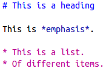
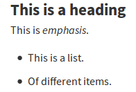

Collaborative and automated writing of papers and reports
=========================================================

We will look at Authorea, one of the platforms for creating scientific
papers online in a collaborative way. Then we will look at what is
Markdown and how do we use it on Authorea.
Finally, we will look at one aspect of open access, particularly
licensing, i.e. what can happen with the paper after it is published.

Tools
-----

Markdown
````````

Markdown is a way how include things such a headings and lists into
a documents while still keeping it as a simple text file.
Generally speaking, Markdown is a markup language like HTML but simpler
(and also less powerful).

In Authorea, go to *Insert* -> *Markdown* and type or copy paste there
the following text:

::

    # This is a heading

    This is *emphasis*.

    * This is a list.
    * Of different items.



    Markdown when edited in the text editor (or Markdown mode in Authorea)



    Markdown when rendered (e.g., after converting to HTML)

To practice Markdown, we will use online editor Dillinger (which can be
used for free online and is also open source): 

https://dillinger.io/

Markdown with Pandoc
````````````````````
http://pandoc.org

Markdown is a simple markup language for include formatting into a
plain text document. Pandoc is a conversion tool which can convert
Markdown files and many other files into other formats.

Pandoc is licensed under GNU GPL.

To see the format conversions without installing Pandoc use
the `Try Pandoc! <https://pandoc.org/try/>`_ service.

reStructuredText with Sphinx/Docutils
`````````````````````````````````````

reStructuredText: http://docutils.sourceforge.net/rst.html

Docutils: http://docutils.sourceforge.net

Sphinx: http://sphinx-doc.org

**reStructuredText** is an plain text markup syntax similar to
aforementioned Markdown. It is often used for software
documentation, for example in Python docstrings.
reStructuredText is, unlike Markdown, designed for extensibility for
specific application domains.
reStructuredText is applicable to non-trivial cases like LaTeX,
but still striving to keep simple syntax like Markdown.

**Docutils** is an open-source text processing system for processing
plain text into formats, such as HTML, LaTeX, man-pages, open-document
or XML.
Docutils processes reStructuredText and can be used from command line
or as a Python package. Another software which can process
reStructuredText in a similar manner is Pandoc.

**Sphinx** is a tool that creates documentation from reStructuredText sources.
It is used for Python documentation and it is universal enough to be
used for software projects in general.
The output formats include HTML, LaTeX (for printable PDF versions),
ePub, and more.
Sphinx uses the Docutils to parse the reStructuredText.

Sphinx is licensed under BSD and Docutils are placed into public domain.

Authorea
````````

Authorea is freemium cloud platform for writing scientific articles.
Optionally, try writing a document at:

https://www.authorea.com/

Note: When creating account or article on Authorea, use your
institutional (NCSU) email, but don't send announcement about it
to all people in the institution (which is something Authorea may
do by default if you won't say no!).

Open access and licenses
````````````````````````

Publishing an article as open access is usually achieved by licensing
it using one of the Creative Commons licenses.

For example, MDPI uses CC BY (Creative Commons Attribution License).
In `a description of an article <http://www.mdpi.com/2220-9964/4/2/942>`_
MDPI says:

    This is an open access article distributed under the Creative Commons
    Attribution License which permits unrestricted use, distribution,
    and reproduction in any medium, provided the original work
    is properly cited. (CC BY 4.0).

CC BY is also used, for example, by PLOS and it is the most common
license used for open access articles.

Another license commonly used for open access articles is CC BY-NC
(Creative Commons Attribution-NonCommercial License)
sometimes combined also with ND (NoDerivatives) part
(CC BY-NC-ND or CC BY-ND) preventing commercial use and modifications.
What that exactly means in each particular case is often hard to
determine [Redhead, 2012], but it is clear that these licenses
doen't fulfill the Open Definition:

    Open means anyone can freely access, use, modify, and share for any
    purpose (subject, at most, to requirements that preserve provenance
    and openness).

The "preservation of provenance" part is for example the attribution in CC BY
and the "preservation of openness" part can be found for example in
CC BY-SA (Creative Commons Attribution-ShareAlike License).
CC BY-SA is sometimes used for open access articles and is quite
commonly used in general, for example at Wikipedia.
The CC BY-SA license requires that the derived works are distributed
only under the same or similar license.

Creative Common licenses have both "human-readable summaries"
("plain English")
and a full legal language license documents.

Resources
---------

Videos
``````

* `Markdown in Authorea <http://fatra.cnr.ncsu.edu/open-science-course/writing-markdown.mp4>`_ (recording from the class, 4 mins)
* `Working with references in Authorea <http://fatra.cnr.ncsu.edu/open-science-course/writing-authorea-references.mp4>`_ (recording from the class, 10 mins)
* `Open Access and Creative Commons Licenses <http://fatra.cnr.ncsu.edu/open-science-course/writing-cc-licenses.mp4>`_ (recording from the class, 13 mins)
* `Open definition is about freedoms <http://fatra.cnr.ncsu.edu/open-science-course/writing-open-and-free.mp4>`_ (recording from the class, 3 mins)
* `Is open a reaction to proprietary? <http://fatra.cnr.ncsu.edu/open-science-course/writing-reaction-or-standard.mp4>`_ (recording from the class, 3 mins)
* `Creative Commons & Copyright Info <https://www.youtube.com/watch?v=8YkbeycRa2A>`_

Texts
`````

* `Freemium <https://en.wikipedia.org/wiki/Freemium>`_ (Wikipedia)
* `Gratis versus libre <https://en.wikipedia.org/wiki/Gratis_versus_libre>`_ (Wikipedia)
* `Markdown <https://daringfireball.net/projects/markdown/>`_ (Original Daring Fireball document)
* `In the beginning, there is Markdown <https://heracl.es/markdown>`_
* `Creative Commons Licenses <https://creativecommons.org/licenses/>`_ (About The Licenses)
* `Writing Technical Papers with Markdown <http://blog.kdheepak.com/writing-papers-with-markdown.html>`_
* `reStructuredText Primer for Sphinx <http://www.sphinx-doc.org/en/stable/rest.html>`_
* `Differencees between reStructuredText, Docutils, and Sphinx <https://coderwall.com/p/vemncg/what-is-the-difference-rest-docutils-sphinx-readthedocs>`_
* `reStructuredText vs Markdown for documentation <http://zverovich.net/2016/06/16/rst-vs-markdown.html>`_
* `WYSIWYG <https://en.wikipedia.org/wiki/WYSIWYG>`_
* `WYSIWYM <https://en.wikipedia.org/wiki/WYSIWYM>`_

References
----------

* Herb, Ulrich (2014). Total numbers and shares of Open Access Journals using Creative Commons licenses as listed by the Directory of Open Access Journals; ZENODO; DOI: `10.5281/zenodo.8327 <http://dx.doi.org/10.5281/zenodo.8327>`_
* `The Open Definition <http://opendefinition.org/>`_ (accessed: 2017-08-22)
* Claire Redhead. 2012. Why CC-BY? URL: https://oaspa.org/why-cc-by/ (accessed: 2017-08-22)

Assignment
----------

Write a paragraph or two using about Authorea or Creative Commons into
the following documents. Use Markdown to write it. Include a heading
of the topic you are writing about and some other formating. Pick
a topic which is not yet described by other student.

If writing about Authorea the topics may include:
using Markdown, using the default editor, using LaTeX, including
figures, tables, exports, imports, account policies and payments,
etc. Try out the feature as you are writing about it.
If writing about Creative Commons, the topics may include:
description of a specific license, advantages and disadvantages,
use cases, etc. Feel free to search for existing texts
and draw from them (and cite and quote them).

You will need to request access by emailing the class instructor (vpetras).
The links to the documents follow.

Authorea:
https://www.authorea.com/users/23014/articles/195127-title

Creative Commons:
https://www.authorea.com/users/23014/articles/195129-title
